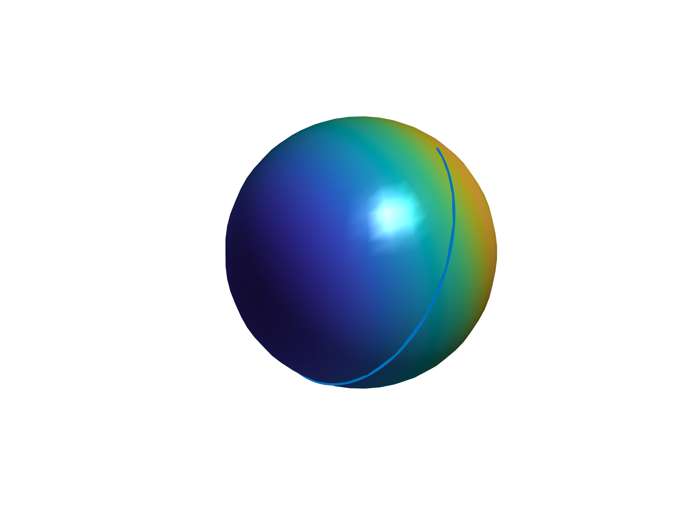
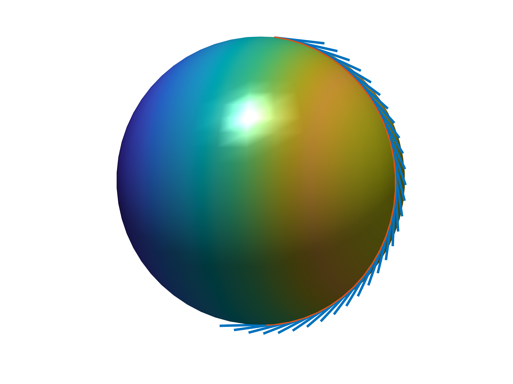
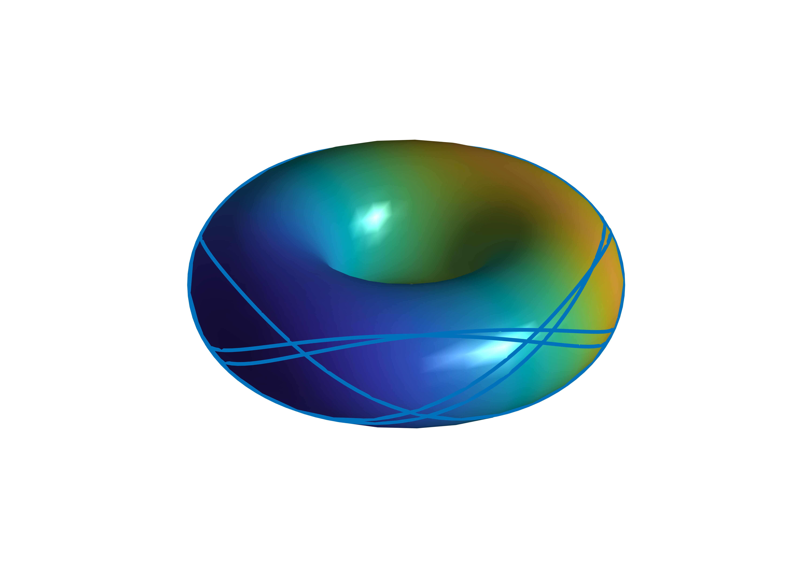
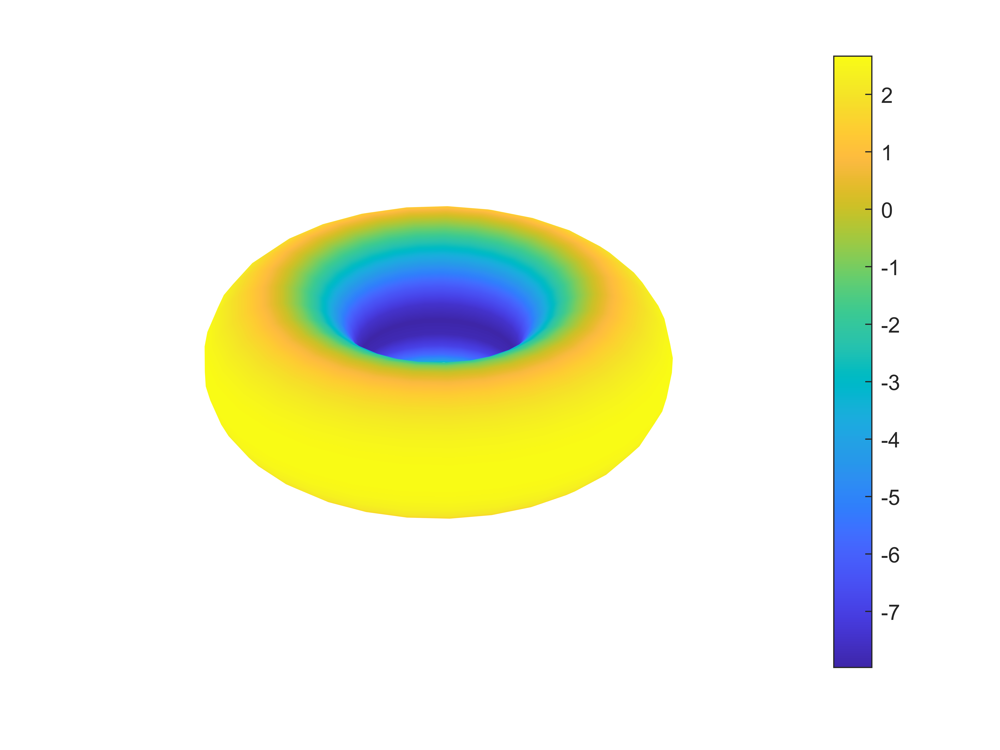

In this matlab program, you can calculate the following:

 - metric tensor
 - riemannian connection
 - riemann curvature tensor
 - ricci curvature tensor
 - scalar curvature
 - gauss Curvature
 - parallel transport
 - geodesic
 - visualization of surface
 - visualization of parallel transport
 - visualization of scalar curvature
 - visualization of geodesic

It is recommended to use the latest version of matlab

 **Input**: parametric equation
 
 
This routine will automatically calculate metrics induced by the ambient three-dimensional euclidean space.
## some sample outputs
||
|:----:|
|**sphere geodesic**|

||
|:----:|
|**sphere parallel**|

||
|:----:|
|**torus parallel**|

||
|:----:|
|**torus geodesic**|

||
|:----:|
|**torus curvature**|

||
|:----:|
|**hyperbolic parallel**|

||
|:----:|
|**hyperbolic geodesic**|

differential_geometry.m
这是一个 MATLAB 类，名为 `differential_geometry`。这个类实现了一些微分几何的计算和可视化。类中的属性和方法如下：

#### 属性：

- `n`：坐标系的维度；
- `coordinate`：表示坐标系的符号数组；
- `X`：定义曲面或流形的坐标函数；
- `g`：定义度量张量的符号数组；
- `connection`：定义联络的符号数组；
- `Riemann_curvature_tensor`：Riemann 曲率张量；
- `Riemann_curvature_metric_tensor`：与度量张量相联系的 Riemann 曲率张量；
- `Ricci_tensor`：Ricci 张量；
- `Scalar_curvature`：标量曲率；
- `Gauss_curvature`：高斯曲率；
- `FaceColor`：绘制曲面时的颜色；
- `alpha`：绘制曲面时的透明度；
- `scale`：平行移动向量的比例尺。

#### 方法：

- `geodesic(interval, Init, interval_num)`：计算并绘制测地线；
- `parallel_transport(u, interval, Init, interval_num)`：计算并绘制平行移动；
- `drawmesh(uinterval, vinterval, draw_curvature, interval_num)`：绘制曲面。

